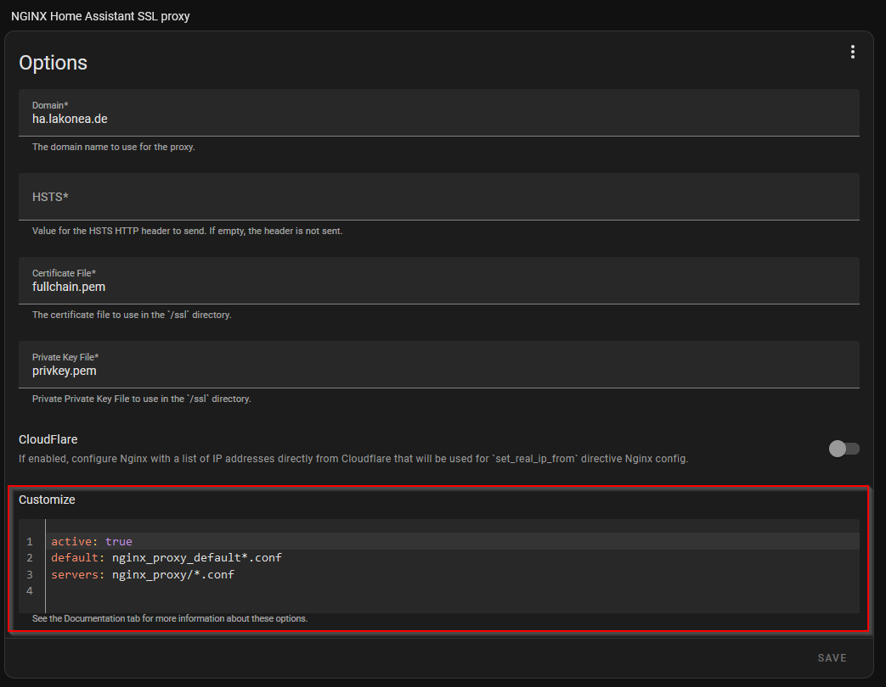

# OpenWebUI Add-on Documentation

## Installation Using HACS

1. Go to your [Home Assistant's Addon Store](https://my.home-assistant.io/redirect/supervisor_store/)
2. Click the three dots in the upper right and add the custom repository: `https://github.com/mikastamm/open-webui-homeassistant-addon` 
3. Install the **OpenWebUI** add-on from the add-on store.  
4. Start the add-on.

---

## Accessing OpenWebUI

After installing and starting the **OpenWebUI** add-on, you can access it through your Home Assistant URL. By default, it runs on port **8080**. For example:

http://homeassistant.local:8080


---

## Microphone Access

**Important:** Most web browsers block microphone access on non-secure (HTTP) sites. This means that if your Home Assistant URL isn’t using HTTPS, the speech-to-text features won’t work. To enable these features, you’ll need to secure your connection. One way to do this is by hosting OpenWebUI on a subdomain with SSL enabled (see the next section).

---

## Example: Hosting OpenWebUI on a Subdomain with SSL

Hosting OpenWebUI on a subdomain allows you to secure your connection with HTTPS. In this example, we use the NGINX add-on together with the Let's Encrypt Home Assistant add-on.

> **Warning:** This configuration makes OpenWebUI publicly accessible. Use it at your own risk and be sure to set a strong password.

### Prerequisites

- **Local Access:** Verify that you can reach OpenWebUI on your local Home Assistant domain (e.g., `http://homeassistant.local:8080`).

---

### Step 1: DNS Configuration

If your Home Assistant instance is reachable at `myhome.com` and you want to serve OpenWebUI from `chat.myhome.com`, add a CNAME DNS record for your subdomain.

**Example DNS Record:**

- **CNAME:** `chat.myhome.com` → `myhome.com`

---

### Step 2: Set Up SSL for the Subdomain

This guide assumes you already have SSL enabled for your Home Assistant domain via the Let's Encrypt add-on. To secure your subdomain:

1. **Add the Subdomain:**  
   Open your Let's Encrypt settings and include your subdomain (e.g., `chat.myhome.com`) in the domains field.

2. **Run Let's Encrypt:**  
   Start the Let's Encrypt add-on and verify that the process completes successfully.

3. **Confirm Files:**  
   If successful, you should see the following files on your system:
   - `/ssl/fullchain.pem`
   - `/ssl/privkey.pem`

   

   *Note: This setup was tested using the HTTP validation method.*

---

### Step 3: Configure NGINX for the Subdomain

Now, configure the NGINX Home Assistant add-on so that requests to your subdomain are forwarded to OpenWebUI.

1. **Enable Custom Configuration:**
   - In the NGINX add-on settings, enable the **Customize** option by setting `active` to `true`.
   - The `server` property (indicating where NGINX will look for configuration files) can usually remain at its default value.

   

2. **Create a Subdomain Configuration File:**
   - On your Home Assistant system, create a directory named `nginx_proxy` if it doesn’t already exist.
   - Create a file at the following location:
     ```
     /share/nginx_proxy/chat.myhome.com.conf
     ```

3. **Add the Following Configuration:**

   ***
   # Redirect HTTP to HTTPS
   server {
       listen 80;
       server_name chat.myhome.com;
       return 301 https://$host$request_uri;
   }

   server {
       listen 443 ssl;
       server_name chat.myhome.com;

       ssl_certificate /ssl/fullchain.pem;
       ssl_certificate_key /ssl/privkey.pem;
       
       # Optional security headers
       add_header X-Content-Type-Options nosniff;
       add_header X-Frame-Options "SAMEORIGIN";
       add_header Referrer-Policy "no-referrer-when-downgrade";

       location / {
           # Forward requests to your OpenWebUI instance
           proxy_pass http://homeassistant.local:8080;
           proxy_set_header Host $host;
           proxy_set_header X-Real-IP $remote_addr;
           proxy_set_header X-Forwarded-For $proxy_add_x_forwarded_for;
           proxy_set_header X-Forwarded-Proto $scheme;
           
           # Enable WebSocket support
           proxy_http_version 1.1;
           proxy_set_header Upgrade $http_upgrade;
           proxy_set_header Connection "upgrade";
       }
   }
   ***

   > **Tip:** If your local OpenWebUI address differs from `http://homeassistant.local:8080`, update the `proxy_pass` URL accordingly.

---

Once this configuration is in place, you can access OpenWebUI securely via your subdomain:

https://chat.myhome.com
